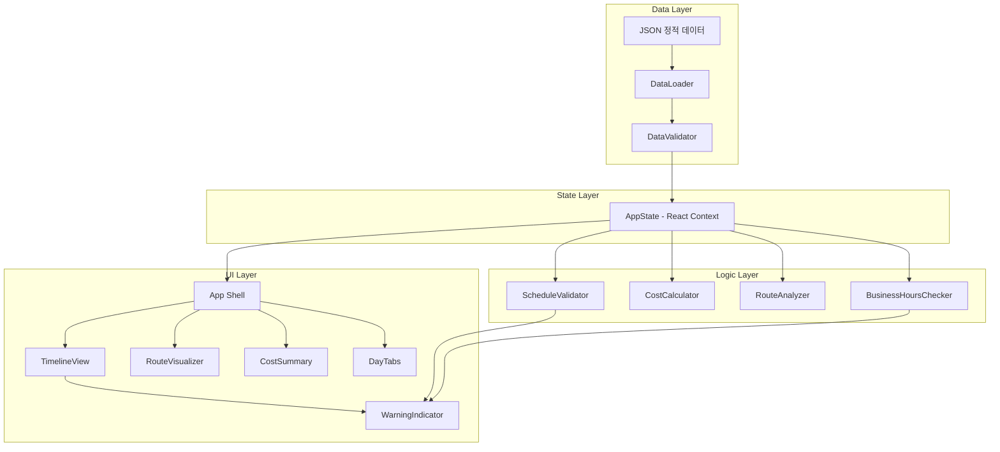
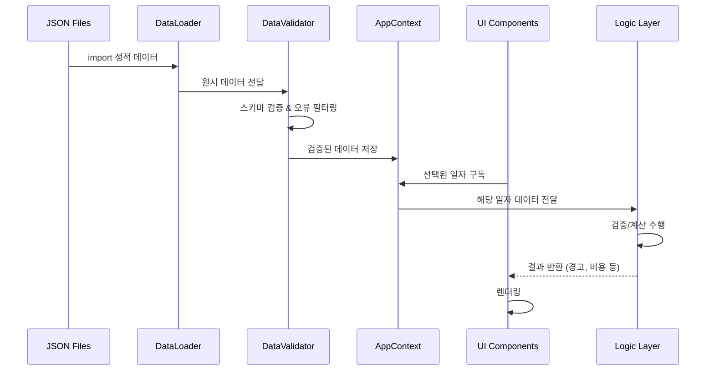
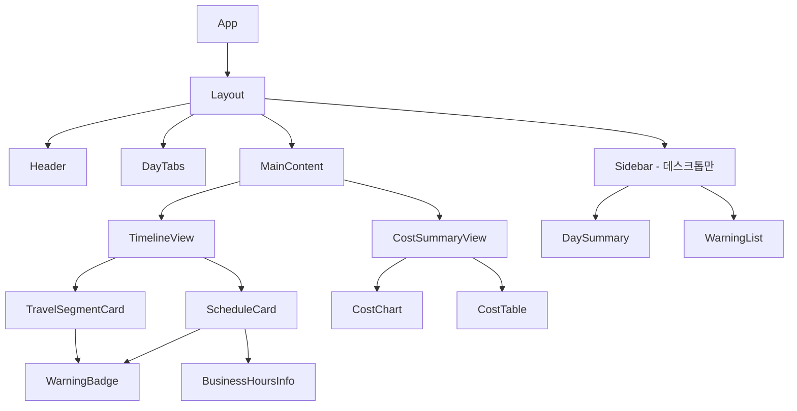

# Design Document: Nagoya Trip Planner

## Overview

나고야 4일 여행 일정 플래너는 React 기반 SPA(Single Page Application)로, 정적 JSON 데이터를 기반으로 일정 타임라인, 영업시간 경고, 이동 경로 시각화, 비용 요약, 일정 검증 기능을 제공한다. 서버 없이 클라이언트 사이드에서 모든 로직을 처리하며, 여행 중 모바일에서도 사용 가능한 반응형 UI를 제공한다.

### 핵심 설계 원칙

- **오프라인 우선**: 서버 의존 없이 정적 JSON 데이터로 동작
- **모바일 우선**: 여행 중 모바일 사용을 최우선으로 고려한 반응형 설계
- **순수 로직 분리**: UI와 비즈니스 로직(검증, 비용 계산)을 분리하여 테스트 용이성 확보
- **타입 안전성**: TypeScript를 활용한 데이터 모델 정의

### 기술 스택

| 영역 | 기술 | 선택 이유 |
|------|------|-----------|
| 프레임워크 | React 18 + TypeScript | 컴포넌트 기반 UI, 타입 안전성 |
| 빌드 도구 | Vite | 빠른 개발 서버, 간단한 설정 |
| 스타일링 | CSS Modules | 컴포넌트 스코프 스타일, 추가 의존성 없음 |
| 차트 | Recharts | React 네이티브 차트 라이브러리, 가벼움 |
| 테스트 | Vitest + fast-check | 단위 테스트 + 속성 기반 테스트 |
| 린팅 | ESLint + Prettier | 코드 품질 유지 |

## Architecture

### High-Level Architecture



### 레이어 설명

1. **Data Layer**: JSON 파일 로드, 파싱, 유효성 검증
2. **Logic Layer**: 순수 함수로 구현된 비즈니스 로직 (검증, 계산, 분석)
3. **State Layer**: React Context를 통한 앱 상태 관리
4. **UI Layer**: 사용자 인터페이스 컴포넌트

### 데이터 흐름



## Components and Interfaces

### 컴포넌트 트리



### 주요 컴포넌트 인터페이스

```typescript
// App.tsx - 루트 컴포넌트
interface AppProps {}

// DayTabs.tsx - 일자 탭 네비게이션
interface DayTabsProps {
  days: DayInfo[];
  selectedDay: string; // YYYY-MM-DD
  warningCounts: Record<string, number>;
  onDaySelect: (date: string) => void;
}

// TimelineView.tsx - 타임라인 뷰
interface TimelineViewProps {
  scheduleItems: ScheduleItem[];
  travelSegments: TravelSegment[];
  warnings: Warning[];
  businessHours: BusinessHoursData[];
}

// ScheduleCard.tsx - 일정 카드
interface ScheduleCardProps {
  item: ScheduleItem;
  warnings: Warning[];
  businessHoursInfo: BusinessHoursInfo | null;
}

// TravelSegmentCard.tsx - 이동 구간 카드
interface TravelSegmentCardProps {
  segment: TravelSegment;
  warnings: Warning[];
}

// WarningBadge.tsx - 경고 뱃지
interface WarningBadgeProps {
  type: 'error' | 'warning' | 'info' | 'unknown';
  message: string;
}

// CostSummaryView.tsx - 비용 요약 뷰
interface CostSummaryViewProps {
  dailyCosts: DailyCost[];
  totalCost: number;
}

// CostChart.tsx - 비용 차트
interface CostChartProps {
  data: CategoryCost[];
  chartType: 'pie' | 'bar';
}
```

### Logic Layer 인터페이스

```typescript
// scheduleValidator.ts
function validateSchedule(
  items: ScheduleItem[],
  segments: TravelSegment[],
  businessHours: BusinessHoursData[]
): Warning[];

function detectTimeConflicts(items: ScheduleItem[]): Warning[];
function detectInsufficientStayTime(items: ScheduleItem[], businessHours: BusinessHoursData[]): Warning[];
function detectTravelTimeShortage(items: ScheduleItem[], segments: TravelSegment[]): Warning[];
function detectRouteInefficiency(items: ScheduleItem[]): Warning[];

// costCalculator.ts
function calculateDailyCosts(
  items: ScheduleItem[],
  segments: TravelSegment[]
): DailyCost;

function calculateTotalCosts(dailyCosts: DailyCost[]): TotalCost;
function categorizeItems(items: ScheduleItem[]): Record<Category, ScheduleItem[]>;

// businessHoursChecker.ts
function checkBusinessHours(
  item: ScheduleItem,
  date: string,
  hoursData: BusinessHoursData[]
): BusinessHoursCheckResult;

function isClosedDay(date: string, closedDays: string[]): boolean;
function isOutsideBusinessHours(
  startTime: string,
  endTime: string,
  openTime: string,
  closeTime: string
): boolean;

// routeAnalyzer.ts
function analyzeTravelSegment(
  prevItem: ScheduleItem,
  nextItem: ScheduleItem,
  segment: TravelSegment | undefined
): TravelAnalysisResult;

function calculateDailyTravelSummary(
  segments: TravelSegment[]
): TravelSummary;
```

### Data Layer 인터페이스

```typescript
// dataLoader.ts
function loadScheduleData(): RawScheduleData;
function loadBusinessHoursData(): RawBusinessHoursData;
function loadTravelSegmentData(): RawTravelSegmentData;

// dataValidator.ts
function validateScheduleItems(raw: unknown[]): ValidationResult<ScheduleItem[]>;
function validateBusinessHours(raw: unknown[]): ValidationResult<BusinessHoursData[]>;
function validateTravelSegments(raw: unknown[]): ValidationResult<TravelSegment[]>;

interface ValidationResult<T> {
  data: T;
  errors: ValidationError[];
}

interface ValidationError {
  field: string;
  message: string;
  itemId?: string;
}
```

## Data Models

### 핵심 타입 정의

```typescript
// types/schedule.ts
type Category = '식사' | '관광' | '쇼핑' | '이동';

interface ScheduleItem {
  id: string;
  date: string;           // YYYY-MM-DD
  startTime: string;      // HH:mm (24시간제)
  endTime: string;        // HH:mm (24시간제)
  placeName: string;      // 최대 50자
  category: Category;
  estimatedCost: number;  // 0 이상 정수, 엔화 단위
  memo: string;           // 최대 200자
}

// types/businessHours.ts
type DayOfWeek = 'mon' | 'tue' | 'wed' | 'thu' | 'fri' | 'sat' | 'sun';

interface DailyHours {
  open: string;   // HH:mm
  close: string;  // HH:mm
}

interface BusinessHoursData {
  placeName: string;
  hours: Partial<Record<DayOfWeek, DailyHours>>;
  closedDays: DayOfWeek[];
  notes: string;            // 최대 100자 (예약 필수 등)
  recommendedStayMinutes: number; // 권장 체류시간 (분)
  requiresReservation: boolean;
}

// types/travel.ts
type TransportMode = '전철' | '도보' | '버스';

interface TravelSegment {
  fromItemId: string;
  toItemId: string;
  mode: TransportMode;
  durationMinutes: number;  // 양의 정수
  cost: number;             // 0 이상 정수, 엔화 단위
}

// types/warning.ts
type WarningLevel = 'error' | 'warning' | 'info' | 'unknown';
type WarningType =
  | 'time-conflict'
  | 'closed-day'
  | 'outside-hours'
  | 'travel-time-shortage'
  | 'insufficient-stay'
  | 'route-inefficiency'
  | 'reservation-required'
  | 'no-business-hours'
  | 'no-travel-data';

interface Warning {
  id: string;
  type: WarningType;
  level: WarningLevel;
  message: string;
  targetItemIds: string[];  // 관련 Schedule_Item ID들
  dayDate: string;          // YYYY-MM-DD
}

// types/cost.ts
interface CategoryCost {
  category: Category | '교통';
  amount: number;
  items: { name: string; cost: number }[];
}

interface DailyCost {
  date: string;
  categories: CategoryCost[];
  subtotal: number;
}

interface TotalCost {
  dailyCosts: DailyCost[];
  grandTotal: number;
}

// types/app.ts
interface DayInfo {
  date: string;       // YYYY-MM-DD
  dayNumber: number;  // 1~4
  label: string;      // "1일차 (5/21)"
}

interface AppState {
  days: DayInfo[];
  selectedDate: string;
  scheduleItems: ScheduleItem[];
  businessHours: BusinessHoursData[];
  travelSegments: TravelSegment[];
  warnings: Warning[];
  loadErrors: ValidationError[];
}

// types/common.ts
interface BusinessHoursCheckResult {
  status: 'open' | 'closed-day' | 'outside-hours' | 'unknown';
  hoursDisplay: string | null;  // "HH:MM~HH:MM" 또는 null
  notes: string | null;
  requiresReservation: boolean;
}

interface TravelAnalysisResult {
  hasData: boolean;
  segment: TravelSegment | null;
  hasTravelTimeShortage: boolean;
  availableMinutes: number;
  requiredMinutes: number;
}

interface TravelSummary {
  totalDurationMinutes: number;
  totalCost: number;
  segmentCount: number;
}
```

### JSON 데이터 파일 구조

```
src/
  data/
    schedule.json       # ScheduleItem 배열
    businessHours.json  # BusinessHoursData 배열
    travelSegments.json # TravelSegment 배열
```

**schedule.json 예시:**
```json
[
  {
    "id": "day1-01",
    "date": "2025-05-21",
    "startTime": "09:00",
    "endTime": "10:30",
    "placeName": "나고야성",
    "category": "관광",
    "estimatedCost": 500,
    "memo": "천수각 내부 관람 포함"
  }
]
```

**businessHours.json 예시:**
```json
[
  {
    "placeName": "나고야성",
    "hours": {
      "mon": { "open": "09:00", "close": "16:30" },
      "tue": { "open": "09:00", "close": "16:30" },
      "wed": { "open": "09:00", "close": "16:30" },
      "thu": { "open": "09:00", "close": "16:30" },
      "fri": { "open": "09:00", "close": "16:30" },
      "sat": { "open": "09:00", "close": "16:30" },
      "sun": { "open": "09:00", "close": "16:30" }
    },
    "closedDays": [],
    "notes": "",
    "recommendedStayMinutes": 90,
    "requiresReservation": false
  }
]
```

**travelSegments.json 예시:**
```json
[
  {
    "fromItemId": "day1-01",
    "toItemId": "day1-02",
    "mode": "전철",
    "durationMinutes": 15,
    "cost": 210
  }
]
```

## Correctness Properties

*A property is a characteristic or behavior that should hold true across all valid executions of a system—essentially, a formal statement about what the system should do. Properties serve as the bridge between human-readable specifications and machine-verifiable correctness guarantees.*

### Property 1: 일정 시간순 정렬

*For any* 동일 일자의 ScheduleItem 배열에 대해, 정렬 함수를 적용한 결과는 항상 startTime 기준 오름차순이어야 한다. 즉, 결과 배열의 모든 연속된 두 항목 (i, i+1)에 대해 items[i].startTime <= items[i+1].startTime이 성립해야 한다.

**Validates: Requirements 1.2**

### Property 2: 이동 구간 매칭 정확성

*For any* 시간순 정렬된 ScheduleItem 배열과 TravelSegment 배열에 대해, 타임라인 구성 함수는 연속된 두 항목 (items[i], items[i+1]) 사이에 fromItemId === items[i].id AND toItemId === items[i+1].id인 TravelSegment를 정확히 매칭해야 한다.

**Validates: Requirements 1.4, 3.1**

### Property 3: 비용 포맷팅

*For any* 0 이상의 정수 n에 대해, 비용 포맷팅 함수는 "¥" 접두사와 천 단위 구분 기호(,)를 포함한 문자열을 반환해야 하며, 해당 문자열에서 구분 기호와 접두사를 제거한 숫자 값이 원래 입력 n과 동일해야 한다.

**Validates: Requirements 3.2, 4.3**

### Property 4: 영업시간 조회

*For any* BusinessHoursData와 유효한 날짜(YYYY-MM-DD)에 대해, 영업시간 조회 함수는 해당 날짜의 요일에 해당하는 영업시간을 "HH:MM~HH:MM" 형식으로 반환해야 한다. 반환된 시간의 open 부분은 원본 데이터의 해당 요일 open과 일치하고, close 부분은 해당 요일 close와 일치해야 한다.

**Validates: Requirements 2.1**

### Property 5: 휴무일 감지 및 경고 우선순위

*For any* ScheduleItem과 BusinessHoursData에 대해, 방문 요일이 closedDays에 포함되면 checkBusinessHours 함수는 반드시 'closed-day' 상태만 반환해야 하며, 'outside-hours' 상태를 동시에 반환하지 않아야 한다.

**Validates: Requirements 2.2, 2.6**

### Property 6: 영업시간 외 감지

*For any* 시작시간(startTime), 종료시간(endTime), 영업 시작시간(openTime), 영업 종료시간(closeTime)에 대해, startTime < openTime 이거나 endTime > closeTime이면 isOutsideBusinessHours 함수는 true를 반환해야 하고, openTime <= startTime AND endTime <= closeTime이면 false를 반환해야 한다.

**Validates: Requirements 2.3**

### Property 7: 이동시간 부족 감지

*For any* 연속된 두 ScheduleItem(prevItem, nextItem)과 TravelSegment에 대해, 빈 시간(nextItem.startTime - prevItem.endTime)이 segment.durationMinutes보다 작으면 이동시간 부족 경고가 생성되어야 하고, 빈 시간이 segment.durationMinutes 이상이면 경고가 생성되지 않아야 한다.

**Validates: Requirements 3.3, 5.3**

### Property 8: 일자별 이동 요약 합계

*For any* TravelSegment 배열에 대해, calculateDailyTravelSummary 함수가 반환하는 totalDurationMinutes는 모든 segment.durationMinutes의 합과 같아야 하고, totalCost는 모든 segment.cost의 합과 같아야 한다.

**Validates: Requirements 3.4**

### Property 9: 비용 카테고리 분류 및 집계 정확성

*For any* ScheduleItem 배열과 TravelSegment 배열에 대해, calculateDailyCosts 함수가 반환하는 결과에서: (1) 각 ScheduleItem은 자신의 category에 해당하는 CategoryCost에 포함되어야 하고, (2) TravelSegment 비용은 '교통' 카테고리에 포함되어야 하며, (3) subtotal은 모든 CategoryCost.amount의 합과 같아야 하고, (4) estimatedCost가 0인 항목은 집계에서 제외되어야 한다.

**Validates: Requirements 4.1, 4.2, 4.5**

### Property 10: 시간 충돌 감지

*For any* 동일 일자의 두 ScheduleItem에 대해, 두 항목의 시간 범위가 1분 이상 겹치면(즉, overlap = min(endA, endB) - max(startA, startB) >= 1분) detectTimeConflicts 함수는 해당 두 항목에 대한 'time-conflict' 경고를 생성해야 하고, 겹치지 않으면 경고를 생성하지 않아야 한다.

**Validates: Requirements 5.1**

### Property 11: 체류시간 부족 감지

*For any* ScheduleItem과 해당 장소의 recommendedStayMinutes에 대해, 할당 시간(endTime - startTime)이 recommendedStayMinutes보다 30분 이상 짧으면 'insufficient-stay' 경고가 생성되어야 하고, 그렇지 않으면 경고가 생성되지 않아야 한다.

**Validates: Requirements 5.2**

### Property 12: 동선 비효율 감지

*For any* 동일 일자의 3개 이상 연속된 ScheduleItem 시퀀스에 대해, A→B→A 패턴(items[i].placeName === items[i+2].placeName이고 items[i].placeName !== items[i+1].placeName)이 존재하면 detectRouteInefficiency 함수는 'route-inefficiency' 경고를 생성해야 한다.

**Validates: Requirements 5.4**

### Property 13: 경고 카운트 집계

*For any* Warning 배열에 대해, 일자별 경고 카운트는 해당 dayDate를 가진 Warning의 수와 정확히 일치해야 한다.

**Validates: Requirements 5.5**

### Property 14: 데이터 검증 라운드트립

*For any* 유효한 ScheduleItem/BusinessHoursData/TravelSegment 객체에 대해, 해당 객체를 JSON으로 직렬화한 후 검증 함수에 통과시키면 원본과 동일한 데이터가 반환되어야 한다. 또한, 필수 필드가 누락된 객체는 검증 함수가 에러를 보고해야 한다.

**Validates: Requirements 6.2, 6.3, 6.4**

### Property 15: 부분 실패 처리

*For any* 유효한 항목과 무효한 항목이 혼합된 배열에 대해, 검증 함수는 유효한 항목만 data 필드에 포함하여 반환해야 하며, 무효한 항목 수만큼의 에러를 errors 필드에 포함해야 한다. 즉, data.length + errors.length === 원본 배열 길이가 성립해야 한다.

**Validates: Requirements 6.5**

## Error Handling

### 데이터 로드 오류

| 오류 유형 | 처리 방식 |
|-----------|-----------|
| JSON 파싱 실패 | 콘솔 에러 출력, 빈 데이터로 앱 표시, 사용자에게 "데이터 로드 실패" 알림 |
| 필수 필드 누락 | 해당 항목 제외, 콘솔 경고 출력, 나머지 데이터 정상 표시 |
| 형식 오류 (잘못된 시간 형식 등) | 해당 항목 제외, 콘솔 경고 출력 |
| 중복 ID | 첫 번째 항목만 유지, 콘솔 경고 출력 |

### 런타임 오류

| 오류 유형 | 처리 방식 |
|-----------|-----------|
| 영업시간 데이터 미존재 | 'unknown' 상태 반환, "영업정보 미확인" 표시 |
| 이동 구간 데이터 미존재 | null 반환, "이동정보 미등록" 표시 |
| 비용 계산 시 NaN | 0으로 대체, 콘솔 경고 |

### Error Boundary

React Error Boundary를 최상위에 배치하여 예기치 않은 렌더링 오류 시 폴백 UI를 표시한다.

```typescript
// ErrorBoundary.tsx
interface ErrorBoundaryState {
  hasError: boolean;
  error: Error | null;
}
```

## Testing Strategy

### 테스트 구조

```
src/
  __tests__/
    logic/
      scheduleValidator.test.ts      # 일정 검증 로직
      scheduleValidator.property.ts  # 속성 기반 테스트
      costCalculator.test.ts         # 비용 계산 로직
      costCalculator.property.ts     # 속성 기반 테스트
      businessHoursChecker.test.ts   # 영업시간 체크 로직
      businessHoursChecker.property.ts
      routeAnalyzer.test.ts          # 이동 경로 분석
      routeAnalyzer.property.ts
      dataValidator.test.ts          # 데이터 검증
      dataValidator.property.ts
    utils/
      formatters.test.ts             # 포맷팅 유틸리티
      formatters.property.ts
    components/
      DayTabs.test.tsx               # 컴포넌트 단위 테스트
      TimelineView.test.tsx
      ScheduleCard.test.tsx
      CostSummaryView.test.tsx
```

### 테스트 도구

- **Vitest**: 테스트 러너 (Vite 네이티브 지원)
- **fast-check**: 속성 기반 테스트 라이브러리
- **React Testing Library**: 컴포넌트 테스트

### 속성 기반 테스트 설정

- 라이브러리: `fast-check`
- 최소 반복 횟수: 100회
- 각 테스트에 설계 문서 속성 참조 태그 포함
- 태그 형식: `Feature: nagoya-trip-planner, Property {number}: {title}`

### 단위 테스트 (예시 기반)

단위 테스트는 다음에 집중한다:
- 구체적인 예시 시나리오 (실제 나고야 일정 데이터 기반)
- 엣지 케이스 (빈 배열, 데이터 누락, 경계값)
- 컴포넌트 렌더링 확인
- 통합 포인트 (Context와 컴포넌트 연동)

### 테스트 커버리지 목표

| 영역 | 목표 |
|------|------|
| Logic Layer (순수 함수) | 90% 이상 |
| Data Layer (검증) | 85% 이상 |
| UI Components | 70% 이상 |

